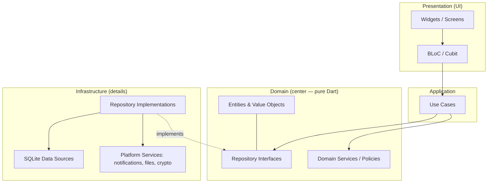
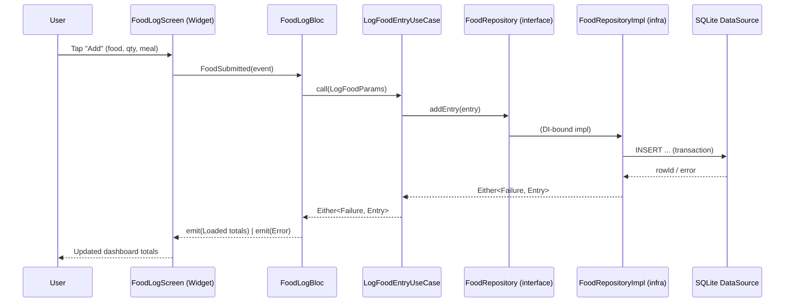

# Phase 3 — Architecture

> Part of the [LifeLedger Specification](00-README-index.md). Depends on: [01](01-vision.md), [02](02-requirements.md). Feeds: [04](04-database-design.md)–[12](12-implementation-plan.md).

This document defines the system architecture: layering, state management, dependency
injection, error handling, and the module boundaries every other phase must respect.

---

## 1. Architectural Style: Clean Architecture

We adopt **Clean Architecture** with strict, one-directional dependencies. The core rule:

> **Dependencies point inward. Inner layers know nothing about outer layers.**
> Domain is the center and depends on nothing. UI and database are details on the outside.

### 1.1 Layers



| Layer | Responsibility | Knows about | May NOT know about |
|---|---|---|---|
| **Presentation** | Render UI; translate user intent into use-case calls; render state emitted by BLoC/Cubit. | Application, Domain (entities) | Infrastructure, SQLite |
| **Application** | Orchestrate a single operation (a use case). No UI, no SQL. | Domain | Presentation, Infrastructure internals |
| **Domain** | Business entities, value objects, repository **interfaces**, pure policies (e.g., health formulas live here as pure functions). Zero Flutter/SQLite imports. | Nothing external | Everything else |
| **Infrastructure** | Implement repository interfaces; talk to SQLite; wrap platform services. | Domain (to implement interfaces) | Presentation |

**Enforcement:** import rules are lint-enforced ([10](10-coding-standards.md)). A Widget importing
`sqflite` is a build-breaking violation. The domain layer has **no** dependency on Flutter.

### 1.2 Why Clean Architecture here
- The product will live 10 years and grow many trackers — **modularity and testability** dominate.
- Health formulas and business rules must be **unit-testable without a device** (NFR-20). Pure
  domain achieves this.
- Persistence is a detail: keeping SQLite behind interfaces lets us add cloud sync or swap
  `sqflite` for `drift` later without touching business logic.

---

## 2. State Management Decision: BLoC + Cubit

**Decision: use the `bloc` package — `Cubit` for simple state, `Bloc` for event-driven flows.**
Recorded as [ADR-0002](adr/0001-record-architecture-decisions.md#adr-0002).

### 2.1 Options considered

| Option | Strengths | Weaknesses | Verdict |
|---|---|---|---|
| **BLoC + Cubit** | Explicit, testable state transitions; clear separation of events/states; mature; excellent Clean-Architecture fit; deterministic and easy to unit-test; team familiarity (consistent with existing Flutter/POS work). | More boilerplate than alternatives (mitigated by Cubit for simple cases). | **Chosen** |
| **Riverpod** | Compile-safe DI + reactive providers; less boilerplate; great testability. | Different idiom from the team's existing code; DI and state blur together; migration cost; overlaps with our explicit `get_it` DI choice. | Rejected |
| **Provider (raw)** | Simple, official-adjacent. | Scales poorly; encourages logic in widgets; weak for complex async flows. | Rejected |
| **setState / InheritedWidget only** | Zero deps. | No structure at scale; untestable business logic in UI — violates NFR-19/20. | Rejected |
| **MobX / GetX** | Terse. | GetX mixes concerns and hurts testability/maintainability; MobX codegen + smaller ecosystem fit. | Rejected |

### 2.2 Rationale
- **Testability first:** a Cubit/Bloc is a pure input→state function; its tests need no widgets
  (using `bloc_test`). This directly serves NFR-20/21.
- **Explicit state:** every screen renders a single, exhaustive state object
  (`Loading | Loaded | Error`) — no ambiguous intermediate UI, satisfying deterministic UX.
- **Boundary hygiene:** BLoC/Cubit call **use cases**, never repositories or SQLite directly,
  keeping the presentation layer thin.

### 2.3 Conventions
- **Cubit** for screens with straightforward state (e.g., a settings toggle, a stepper).
- **Bloc** where discrete events with side effects and history matter (e.g., food-log flow,
  onboarding wizard).
- State classes are **immutable** (sealed/`freezed`-style unions) and exhaustively handled in UI.
- One Bloc/Cubit per screen or per cohesive feature slice; no global mega-bloc.

---

## 3. Dependency Injection

**Decision: `get_it` (service locator) configured by `injectable` (codegen).** ([ADR-0003](adr/0001-record-architecture-decisions.md#adr-0003))

- Registration lives in an infrastructure composition root; nothing else references
  concrete implementations.
- Lifetimes: **singletons** for stateless services (DB, repositories); **factories** for
  Blocs/Cubits and use cases.
- Tests override registrations with fakes/mocks (see [11](11-testing-strategy.md)).
- **Why `get_it` over Riverpod-as-DI:** we deliberately separate *DI* (get_it) from *state*
  (BLoC) so each does one job; this keeps the domain unaware of any DI framework.

---

## 4. Error Handling Model

**Decision: functional error handling with `Either<Failure, T>` (via `dartz` or an equivalent
minimal `Result` type). Exceptions are not thrown across layer boundaries.** ([ADR-0004](adr/0001-record-architecture-decisions.md#adr-0004))

- Infrastructure catches low-level exceptions (SQLite, IO) and maps them to typed **`Failure`**
  objects in the domain.
- Repository interfaces return `Future<Either<Failure, T>>`. Use cases propagate `Either`.
- Blocs convert `Left(Failure)` into an error **state** with a user-friendly, localized message.

### 4.1 Failure taxonomy (domain)
```
Failure (sealed)
├─ DatabaseFailure(message, cause?)       // read/write/migration errors
├─ ValidationFailure(field, reason)       // domain-rule violations
├─ NotFoundFailure(entity, id)
├─ ConflictFailure(reason)                // e.g., duplicate unique key
├─ PermissionFailure(permission)          // OS permission denied
├─ BackupFailure(stage)                   // export/import/restore
└─ UnexpectedFailure(message, cause?)     // last resort; logged locally
```
- **No silent failures.** Every `Left` is either shown to the user or written to a local,
  privacy-safe diagnostic log (never network).
- Validation happens in the **domain** (value objects) *and* is surfaced in the UI for fast
  feedback — the domain is the source of truth.

---

## 5. Cross-Cutting Concerns

| Concern | Approach |
|---|---|
| **Logging** | Thin abstraction (`AppLogger`) with a local-only sink. No PII, no network. Verbose in debug, minimal in release. |
| **Time** | A `Clock` abstraction (never call `DateTime.now()` directly in domain/app) — enables deterministic tests and correct day-boundary handling. |
| **Config** | Compile-time flavors (dev/prod) + a settings service for user preferences. |
| **Localization** | `.arb` files; `AppLocalizations` injected where needed (NFR-24). |
| **Feature flags** | Simple local flags to gate roadmap features (sync, Health Connect) behind stable interfaces. |
| **Concurrency** | Long/heavy work (report aggregation, import) off the UI isolate where measurable; DB access serialized through the data source. |

---

## 6. Data Flow (example: logging a food entry)



Key point: the Widget never sees SQLite; the domain never sees Flutter.

---

## 7. Module Boundaries (feature-first)

Code is organized **by feature**, and each feature contains its own presentation/application/
domain/infrastructure slices. Shared cross-feature code lives in `core/`. The concrete tree is
in [`09-folder-structure.md`](09-folder-structure.md). The rule enforced here:

- A feature may depend on `core/` and on **domain** contracts of another feature, but never on
  another feature's presentation or infrastructure internals.
- Anything shared by ≥ 2 features is promoted to `core/`.

---

## 8. Technology Stack (decided)

| Concern | Choice | Note |
|---|---|---|
| Language/UI | Dart + Flutter (latest stable) | Android-first, Material 3 |
| State | `bloc` (`flutter_bloc`) | §2 |
| DI | `get_it` + `injectable` | §3 |
| Persistence | `sqflite` (+ `sqflite_common_ffi` for tests) | [04](04-database-design.md) |
| Errors | `Either`/`Result` (`dartz` or minimal) | §4 |
| Immutable models/unions | `freezed` + `equatable` | [10](10-coding-standards.md) |
| Charts | A well-maintained Flutter charting lib (e.g., `fl_chart`) — offline, no network | [05](05-uiux-system.md) |
| Local notifications | `flutter_local_notifications` | [08](08-feature-specs.md) |
| Crypto (backup) | Vetted encryption lib; keys via platform keystore | [08](08-feature-specs.md) |
| Testing | `flutter_test`, `bloc_test`, `mocktail` | [11](11-testing-strategy.md) |

*Every dependency must pass the privacy review in [10](10-coding-standards.md): no ads, no analytics, actively maintained, license-compatible.*

---

## 9. Architecture Risks

| Risk | Mitigation |
|---|---|
| Boilerplate fatigue with BLoC | Use Cubit for simple state; code snippets/templates; codegen where safe. |
| Layer leakage over time | Lint-enforced import boundaries + code review checklist ([10](10-coding-standards.md)). |
| Report aggregation performance | Push aggregation into SQL with proper indexes ([04](04-database-design.md)); measure. |
| DI misconfiguration at scale | `injectable` codegen + a startup self-check that fails fast in debug. |
| Over-abstraction | YAGNI: interfaces only where a real second implementation or a test seam is needed. |

---

*Next: [Phase 4 — Database Design](04-database-design.md).*
