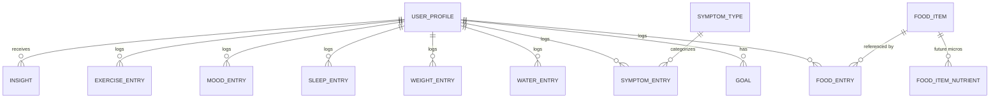
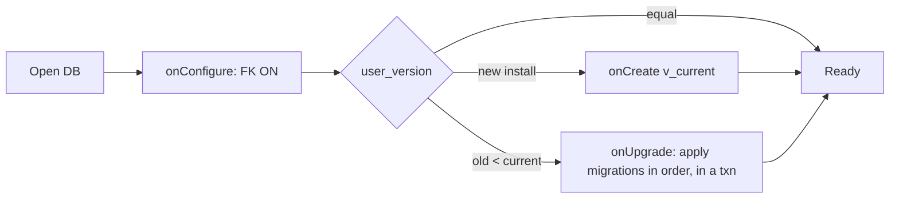

# Phase 4 — Database Design

> Part of the [LifeLedger Specification](00-README-index.md). Depends on: [02](02-requirements.md), [03](03-architecture.md). Feeds: [06](06-health-rules.md)–[08](08-feature-specs.md), [11](11-testing-strategy.md).

The local store is **SQLite** (via `sqflite`). This document defines the schema, integrity
rules, indexes, migration strategy, backup/restore, and how the schema is designed to make
**optional cloud sync** a non-breaking future addition.

---

## 1. Design Principles

1. **Integrity first.** Foreign keys ON; `CHECK` constraints on domains; `NOT NULL` by default.
2. **Time-series shaped.** Most data is "entries over time"; every log table indexes its date.
3. **Sync-ready from day one.** Every user-data row carries `created_at`, `updated_at`,
   `is_deleted`, and a `sync_status` so a future sync engine needs **no** breaking migration.
4. **Soft delete, never hard delete** for user data (hard delete only on explicit "wipe all").
5. **No magic in code.** All units, enum codes, and reference values are documented here and
   mirrored by domain enums.
6. **Immutable history where it matters.** Goal changes and profile-affecting values are
   versioned so historical reports remain accurate ([FR-8](02-requirements.md)).

---

## 2. Conventions

- **Primary keys:** `id` — a UUID (TEXT) so rows are globally unique and merge-safe for future
  sync. *Rationale: autoincrement integers collide across devices; UUIDs do not.*
- **Timestamps:** stored as **UTC epoch milliseconds** (INTEGER). Display converts to local via
  the `Clock`/locale layer ([03](03-architecture.md) §5). *Rationale: unambiguous, comparable, DST-safe.*
- **Booleans:** INTEGER `0/1` (SQLite has no native boolean).
- **Enums:** stored as short TEXT codes (e.g., `meal_slot = 'breakfast'`) — human-readable in DB
  dumps and stable across app versions. Codes are frozen; new values are additive only.
- **Money/nutrition numbers:** REAL for nutrients; quantities REAL with an explicit unit column.
- **Naming:** `snake_case` tables/columns; log tables are singular-domain plural rows
  (e.g., `food_entry`).

### 2.1 Standard audit/sync columns (on every user-data table)
| Column | Type | Meaning |
|---|---|---|
| `id` | TEXT PK | UUID v4. |
| `created_at` | INTEGER NOT NULL | UTC epoch ms of creation. |
| `updated_at` | INTEGER NOT NULL | UTC epoch ms of last modification. |
| `is_deleted` | INTEGER NOT NULL DEFAULT 0 | Soft-delete flag. |
| `sync_status` | TEXT NOT NULL DEFAULT 'local' | `local` \| `pending` \| `synced` \| `conflict` (unused in v1, reserved). |

---

## 3. Entity–Relationship Overview

> Note: v1 is single-user, but `user_id` foreign keys are present everywhere so multi-profile
> and sync are additive later, not a rewrite.

---

## 4. Schema (v1)

The following is the **logical** schema. Exact DDL lives in migration `v1` (§7). Every user-data
table also carries the standard audit/sync columns from §2.1 (omitted below for brevity, shown
once in `food_entry`).

### 4.1 `user_profile`
| Column | Type | Constraints | Notes |
|---|---|---|---|
| `id` | TEXT | PK | UUID |
| `display_name` | TEXT | NULL | optional |
| `sex` | TEXT | CHECK in (`male`,`female`,`unspecified`) | used by BMR formula ([06](06-health-rules.md)) |
| `birth_date` | INTEGER | NULL | epoch ms; used for age |
| `height_cm` | REAL | CHECK > 0 AND < 300 | stored metric; displayed per unit pref |
| `unit_system` | TEXT | CHECK in (`metric`,`imperial`) DEFAULT `metric` | |
| `activity_level` | TEXT | CHECK in (`sedentary`,`light`,`moderate`,`active`,`very_active`) | drives TDEE ([06](06-health-rules.md)) |
| `created_at`,`updated_at`,`is_deleted`,`sync_status` | | | audit/sync |

### 4.2 `goal` (versioned)
| Column | Type | Constraints | Notes |
|---|---|---|---|
| `id` | TEXT | PK | |
| `user_id` | TEXT | FK → user_profile(id) | |
| `type` | TEXT | CHECK in (`calories`,`protein`,`carbs`,`fat`,`fiber`,`sugar`,`water`,`weight`,`sleep`) | |
| `target_value` | REAL | NOT NULL | unit implied by type (see §5) |
| `source` | TEXT | CHECK in (`system`,`user`) | `user` = manual override ([FR-6](02-requirements.md)) |
| `objective` | TEXT | CHECK in (`maintain`,`lose`,`gain`) NULL | only for weight/calorie goals |
| `effective_from` | INTEGER | NOT NULL | epoch ms; enables historical accuracy ([FR-8](02-requirements.md)) |
| `effective_to` | INTEGER | NULL | NULL = currently active |
| audit/sync | | | |

> **Versioning rule:** changing a goal does not UPDATE the row; it closes the current row
> (`effective_to = now`) and INSERTs a new one. Reports select the goal whose
> `[effective_from, effective_to)` window contains the report date.

### 4.3 `food_item` (catalog: seed DB + user-created)
| Column | Type | Constraints | Notes |
|---|---|---|---|
| `id` | TEXT | PK | |
| `name` | TEXT | NOT NULL | |
| `brand` | TEXT | NULL | |
| `is_custom` | INTEGER | 0/1 DEFAULT 0 | user-created vs seed |
| `is_favorite` | INTEGER | 0/1 DEFAULT 0 | ([FR-12](02-requirements.md)) |
| `serving_size` | REAL | CHECK > 0 | in `serving_unit` |
| `serving_unit` | TEXT | NOT NULL | e.g., `g`,`ml`,`piece` |
| `calories` | REAL | CHECK >= 0 | per serving |
| `protein_g` | REAL | CHECK >= 0 | per serving |
| `carbs_g` | REAL | CHECK >= 0 | |
| `fat_g` | REAL | CHECK >= 0 | |
| `fiber_g` | REAL | CHECK >= 0 | |
| `sugar_g` | REAL | CHECK >= 0 | |
| `source_ref` | TEXT | NULL | provenance of seed nutrition data |
| audit/sync | | | |

### 4.4 `food_entry` (a logged food — the core table; shown WITH audit/sync columns)
| Column | Type | Constraints | Notes |
|---|---|---|---|
| `id` | TEXT | PK | UUID |
| `user_id` | TEXT | FK → user_profile(id) NOT NULL | |
| `food_item_id` | TEXT | FK → food_item(id) NOT NULL | |
| `logged_at` | INTEGER | NOT NULL | epoch ms of consumption |
| `local_date` | TEXT | NOT NULL | `YYYY-MM-DD` in the user's local tz at log time |
| `meal_slot` | TEXT | CHECK in (`breakfast`,`lunch`,`dinner`,`snack`) | |
| `quantity` | REAL | CHECK > 0 | multiples of the food's serving |
| `note` | TEXT | NULL | |
| `created_at` | INTEGER | NOT NULL | |
| `updated_at` | INTEGER | NOT NULL | |
| `is_deleted` | INTEGER | 0/1 DEFAULT 0 | |
| `sync_status` | TEXT | DEFAULT 'local' | |

> **Why both `logged_at` and `local_date`?** Daily totals and the "today" dashboard must group by
> the user's *local* calendar day, independent of tz/DST. Storing `local_date` at write time makes
> day-grouping a fast, correct, indexable string comparison instead of runtime tz math.
> `logged_at` (UTC ms) preserves the exact instant for ordering and future sync.
> **Nutrition is not duplicated onto the entry** in v1 (it's derived from `food_item` × `quantity`);
> see §9 for the denormalization trade-off and the historical-accuracy note.

### 4.5 Other log tables (same shape, one row per event)
| Table | Distinct columns (plus common audit/sync + `user_id`, `logged_at`, `local_date`) |
|---|---|
| `water_entry` | `amount_ml REAL CHECK > 0` |
| `weight_entry` | `weight_kg REAL CHECK > 0 AND < 700` |
| `sleep_entry` | `start_at INTEGER`, `end_at INTEGER`, `duration_min INTEGER CHECK >= 0`, `quality INTEGER CHECK 1..5 NULL` |
| `mood_entry` | `mood INTEGER CHECK 1..5`, `note TEXT NULL` |
| `symptom_entry` | `symptom_type_id TEXT FK → symptom_type(id)`, `severity INTEGER CHECK 1..5`, `note TEXT NULL` |
| `exercise_entry` | `activity TEXT`, `duration_min INTEGER CHECK >= 0`, `intensity TEXT CHECK in (light,moderate,vigorous) NULL`, `energy_kcal REAL CHECK >= 0 NULL` |

### 4.6 `symptom_type` (lookup + user-extendable)
| Column | Type | Notes |
|---|---|---|
| `id` TEXT PK, `name` TEXT NOT NULL, `is_custom` INTEGER 0/1, audit/sync | | seeds common symptoms; users add their own |

### 4.7 `insight` (generated by the engine — [07](07-ai-rules.md))
| Column | Type | Notes |
|---|---|---|
| `id` | TEXT PK | |
| `user_id` | TEXT FK | |
| `rule_id` | TEXT NOT NULL | which rule produced it (traceability) |
| `title` | TEXT NOT NULL | plain-language headline |
| `body` | TEXT NOT NULL | explanation |
| `confidence` | TEXT CHECK in (`low`,`medium`,`high`) | uncertainty is mandatory ([FR-28](02-requirements.md)) |
| `evidence_json` | TEXT | the data points that produced it (for explainability, [FR-29](02-requirements.md)) |
| `period_start`,`period_end` | INTEGER | window analyzed |
| `feedback` | TEXT CHECK in (`helpful`,`unhelpful`) NULL | user feedback ([FR-30](02-requirements.md)) |
| `dismissed` | INTEGER 0/1 DEFAULT 0 | |
| audit/sync | | |

### 4.8 `app_meta` (single-row key/value)
| Column | Type | Notes |
|---|---|---|
| `key` TEXT PK, `value` TEXT | | schema-independent app state, e.g., last backup time, onboarding done |

### 4.9 Reserved for future (interfaces only in v1)
- `medication` / `medication_entry` (FR-23) — schema sketched, not created until the feature ships.
- `food_item_nutrient` — key/value micronutrients (vitamins/minerals) for future micro tracking,
  keeping `food_item` stable.
- `health_connect_source` — provenance for imported wearable data (Persona D).

---

## 5. Units Reference (no magic numbers)

| Domain | Stored unit | Displayed per pref |
|---|---|---|
| Height | cm (REAL) | cm or ft/in |
| Weight | kg (REAL) | kg or lb |
| Water | ml (REAL) | ml or fl oz |
| Energy | kcal (REAL) | kcal |
| Macros | grams (REAL) | g |
| Sleep | minutes (INTEGER) | h/m |
| Time | UTC epoch ms | local, per locale |

Conversion factors and formulas are centralized in the domain layer and documented in
[`06-health-rules.md`](06-health-rules.md); the DB always stores the metric canonical unit.

---

## 6. Indexes

Indexes target the hot query paths (dashboard "today", reports over ranges, timelines).

| Index | Table(s) | Columns | Serves |
|---|---|---|---|
| `idx_food_entry_user_date` | food_entry | (`user_id`,`local_date`,`is_deleted`) | daily totals, timeline, dashboard |
| `idx_food_entry_logged` | food_entry | (`user_id`,`logged_at`) | chronological ordering, sync |
| `idx_water_user_date` | water_entry | (`user_id`,`local_date`,`is_deleted`) | water totals |
| `idx_weight_user_date` | weight_entry | (`user_id`,`local_date`) | weight trend/chart |
| `idx_sleep_user_date` | sleep_entry | (`user_id`,`local_date`) | sleep reports |
| `idx_mood_user_date` | mood_entry | (`user_id`,`local_date`) | mood trend, correlations |
| `idx_symptom_user_date` | symptom_entry | (`user_id`,`local_date`) | symptom↔food correlation |
| `idx_exercise_user_date` | exercise_entry | (`user_id`,`local_date`) | exercise reports |
| `idx_goal_user_type_active` | goal | (`user_id`,`type`,`effective_to`) | active goal lookup |
| `idx_food_item_name` | food_item | (`name`) | food search |
| `idx_insight_user_period` | insight | (`user_id`,`period_end`,`dismissed`) | dashboard latest insight |

> Indexing philosophy: index the columns in `WHERE`/`GROUP BY`/`ORDER BY` of the queries in
> [08](08-feature-specs.md); re-measure with `EXPLAIN QUERY PLAN` before adding more. Over-indexing
> slows writes — the log tables are write-heavy.

---

## 7. Migration & Versioning Strategy

**Decision: hand-written, forward-only migrations keyed on SQLite `PRAGMA user_version`.** ([ADR-0005](adr/0001-record-architecture-decisions.md#adr-0005))

- The app declares `schemaVersion = N`. On open, `sqflite` runs `onCreate` (fresh) or
  `onUpgrade(old, new)` applying each migration `old+1 … new` in order, inside a transaction.
- **Migrations are immutable once released.** A shipped migration is never edited; corrections
  ship as a new migration. *Rationale: users upgrade from arbitrary old versions; editing a past
  migration produces divergent schemas.*
- Each migration is a numbered unit with an **up** script and a written description. There is no
  automatic "down" (forward-only); destructive changes are staged (add → backfill → switch → drop
  in a later version) to remain reversible-by-restore.
- **`onConfigure`** enables `PRAGMA foreign_keys = ON` on every connection.
- A **migration test** (see [11](11-testing-strategy.md)) seeds a v(N-1) DB and asserts a clean
  upgrade to vN with data preserved — required for every schema change (NFR-11).

### 7.1 Migration ledger
| Version | Description |
|---|---|
| v1 | Initial schema: all tables in §4, indexes in §6, seed lookups (`symptom_type`), FK enforcement. |
| v2+ | (future) each schema change appends a row here with its migration description. |

---

## 8. Backup, Restore, Export/Import

| Operation | Design |
|---|---|
| **Backup** ([FR-36](02-requirements.md)) | Copy the SQLite file after a `wal_checkpoint`, then **encrypt** the copy (key from platform keystore). Stored to a user-chosen location (SAF). Backup contains a version header = `schemaVersion`. |
| **Restore** | Validate header; if `header < current`, run migrations on the restored copy before swapping it in atomically; if `header > current`, refuse (user must update the app). |
| **Export** ([FR-37](02-requirements.md)) | Serialize all user tables to **JSON** (and optional CSV per table). Human-readable, portable, no proprietary format. |
| **Import** ([FR-38](02-requirements.md)) | Parse + validate against domain rules; UUIDs make merge/insert idempotent; conflicts resolved by `updated_at` (last-write-wins) — the same rule the future sync engine will use. |
| **Wipe all** ([FR-39](02-requirements.md)) | Hard-delete: drop the DB file and secure-clear keys, after an explicit typed confirmation. |

All backup/restore/export/import operations run in transactions and report typed `BackupFailure`
on any error ([03](03-architecture.md) §4).

---

## 9. Denormalization & Historical-Accuracy Trade-off

**Question:** should `food_entry` snapshot the nutrition numbers, or derive them from `food_item`?

- **v1 decision:** derive (join `food_entry` × `food_item`). Simpler, smaller, single source of truth.
- **Risk:** if a user edits a `food_item`'s nutrition later, *past* entries recompute — historically
  inaccurate.
- **Mitigation / future:** `food_item` edits create a **new version** of the item (favor
  copy-on-write for custom foods), and/or add nutrition-snapshot columns to `food_entry` in a later
  migration. This is called out as [ADR-0006](adr/0001-record-architecture-decisions.md#adr-0006)
  (accepted deferral) so the trade-off is explicit, not accidental.

---

## 10. Sync-Readiness (v1 designs for it; does not implement it)

The schema is built so cloud sync is **additive**:
- Global UUID PKs → no cross-device key collisions.
- `updated_at` + `is_deleted` → last-write-wins merge and tombstones without data loss.
- `sync_status` column → track per-row sync state without a new table.
- UTC timestamps → unambiguous ordering across devices/timezones.

A future sync engine adds a change-log/outbox table and a transport; **no existing table changes
shape**. Cloud sync remains **opt-in** and out of scope for v1 ([02](02-requirements.md) §1).

---

## 11. Data-Integrity Summary

- FK enforcement ON (NFR-12); cascading soft-deletes handled in the repository layer, not via
  `ON DELETE CASCADE` (so soft-delete semantics are preserved).
- `CHECK` constraints encode domain ranges (weights, severities 1..5, non-negative nutrients).
- All multi-row writes are transactional (NFR-13).
- The domain layer re-validates before persisting (defense in depth) — the DB is the last line,
  not the only line.

---

*Next: [Phase 5 — UI/UX System](05-uiux-system.md).*
