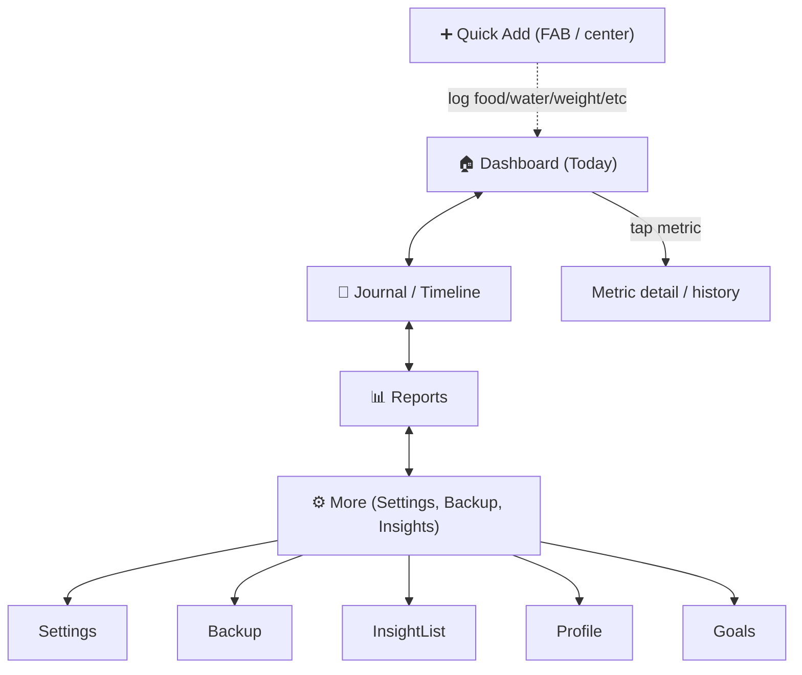

# Phase 5 — UI/UX System

> Part of the [LifeLedger Specification](00-README-index.md). Depends on: [02](02-requirements.md), [03](03-architecture.md). Feeds: [08](08-feature-specs.md), [10](10-coding-standards.md).

The UI must make the mission tangible: **effortless logging, an at-a-glance dashboard, and
meaningful insights** — all accessible, themeable, and fast. This document defines the Material 3
design system, theming, navigation, key screens, and accessibility rules.

---

## 1. Design Principles

1. **Minimal typing.** Prefer taps, steppers, chips, recents, and favorites over keyboards.
2. **Speed is a feature.** The primary action (log food) is always ≤ 2 taps from the dashboard.
3. **Answer first.** The dashboard answers the user's questions before they ask.
4. **Calm, not clinical.** Supportive tone; no red "you failed" framing. Progress, not judgment.
5. **One system.** Every color, spacing, and type choice comes from documented tokens — no ad-hoc styling.
6. **Accessible by default.** If it isn't usable with TalkBack and large fonts, it isn't done.

---

## 2. Material 3 Foundation

- **Material 3 (Material You).** Use `useMaterial3: true`.
- **Dynamic color** on Android 12+ (harmonize to the user's wallpaper) with a **brand fallback
  palette** on older devices ([NFR-14](02-requirements.md)).
- Components: `NavigationBar`, `Card`, `FilledButton`/`FilledButton.tonal`, `Chip`, `Slider`,
  `Snackbar`, `BottomSheet`, M3 dialogs.

### 2.1 Design Tokens
All visual constants live in a single `AppTheme`/token source — **never** hard-coded in widgets
([10](10-coding-standards.md)).

| Token group | Definition |
|---|---|
| **Color** | Derived from an M3 `ColorScheme` seed (brand seed color) + dynamic color. Semantic roles only (`primary`, `surface`, `error`, `tertiary` for accent metrics). Never reference raw hex in widgets. |
| **Typography** | M3 type scale (`displaySmall`…`labelSmall`) mapped to a legible, license-clear font. Respects system font scaling. |
| **Spacing** | 4-pt base grid: 4/8/12/16/24/32. One spacing scale, referenced by name. |
| **Radius** | sm 8 / md 12 / lg 16 / pill for chips. |
| **Elevation** | M3 tonal elevation; avoid heavy shadows. |
| **Motion** | M3 standard easing/duration; reduce/disable when "remove animations" is on. |

---

## 3. Theming (Light / Dark)

- **Three modes:** system (default), light, dark ([FR-40](02-requirements.md)).
- Both themes built from the same `ColorScheme.fromSeed(brightness: …)` so they stay in sync.
- **Contrast:** all text/background pairs meet **WCAG 2.1 AA** (≥ 4.5:1 body, ≥ 3:1 large)
  ([NFR-15](02-requirements.md)). Verified with golden tests where feasible ([11](11-testing-strategy.md)).
- No information conveyed by color alone (icons/labels accompany status colors) — colorblind-safe.

---

## 4. Navigation Model

A **bottom `NavigationBar`** with the primary destinations, plus a prominent central **Quick Add**.



- **Routing:** declarative router (e.g., `go_router`) with typed routes; deep-linkable for future
  notifications/widgets.
- **Depth rule:** every core task ([FR-9](02-requirements.md), FR-17–FR-21) reachable within 2 taps
  from the dashboard ([NFR-17](02-requirements.md)).

---

## 5. Key Screens (wireframes)

Wireframes are ASCII sketches — layout intent, not pixel spec. Final visuals follow the tokens above.

### 5.1 Dashboard (Today) — answers the five questions ([FR-24](02-requirements.md))
```
┌──────────────────────────────────────────┐
│  Good morning, Maya            [profile]  │
│                                            │
│  ┌─ Health Score ─────────────┐  ┌──────┐ │
│  │        78 / 100    ▲ +4     │  │Weight│ │
│  │  goal-adherence today       │  │ 71.2 │ │
│  └─────────────────────────────┘  │ ▼ -0.3│ │
│                                    └──────┘ │
│  Calories   ▓▓▓▓▓▓░░░  1,420 / 2,050       │
│  Protein    ▓▓▓▓▓░░░░    58 / 110 g        │
│  Water      ▓▓▓▓▓▓▓░░   1.4 / 2.1 L        │
│                                            │
│  💡 Insight: "You hit protein 5 of 7 days  │
│     last week — up from 2." (confidence: med)│
│                                            │
│  Quick add:  [🍳 Breakfast] [💧+250] [⚖ Weight]│
└──────────────────────────────────────────┘
        🏠      📓     ➕     📊     ⚙️
```
- Rings/bars show consumed vs. remaining (the "how much remaining?" promise).
- Tapping any metric opens its detail/history.

### 5.2 Quick Add — the < 10 s flow ([FR-10](02-requirements.md))
```
┌── Add Food ──────────────────────────────┐
│  [ Recents ]  [ Favorites ]  [ Search ]   │
│                                            │
│  Recents:                                  │
│   ⬤ Oatmeal          ⬤ Greek yogurt        │
│   ⬤ 2 Eggs           ⬤ Banana              │
│                                            │
│  Meal:  (Breakfast) Lunch  Dinner  Snack   │
│  Qty:   [ − ]  1 serving  [ + ]            │
│                                            │
│  ⌨ or type: "2 eggs and toast"  (NL parse) │
│                             [ Add ✓ ]      │
└────────────────────────────────────────────┘
```
- Opens on **Recents/Favorites** so the common case is a single tap + confirm.
- Meal slot pre-selected by time of day; quantity via stepper (no keyboard needed).
- NL entry ([FR-15](02-requirements.md)) is an accelerator, never the only path.

### 5.3 Journal / Meal Timeline ([FR-16](02-requirements.md))
```
┌── Today ▾ ───────────────────────────────┐
│  Breakfast · 320 kcal · 22 g protein      │
│    • Oatmeal (1)         210 kcal          │
│    • Greek yogurt (1)    110 kcal          │
│  Lunch · 540 kcal                          │
│    • Chicken salad (1)   540 kcal          │
│  💧 Water: 1.4 L    😴 Sleep: 7h10m         │
│  🙂 Mood: Good      🤕 Symptom: none        │
│  ─ swipe an item to edit / delete ─        │
└────────────────────────────────────────────┘
```

### 5.4 Reports ([FR-31](02-requirements.md), [FR-32](02-requirements.md))
- Range selector: Day / Week / Month / Year.
- Charts: calories & macro stacked bars, weight line + moving average, water, sleep, mood.
- Pattern report ([FR-33](02-requirements.md)): two-series overlay (e.g., symptom severity vs. a food flag).
- Charts follow the **dataviz** guidance: categorical macro colors are distinguishable in both
  themes and never rely on color alone (labels + patterns).

### 5.5 Insights list ([07](07-ai-rules.md))
```
┌── Insights ──────────────────────────────┐
│  💡 Protein trending up          med  ⋯   │
│  💡 Lower mood on <6h sleep      low  ⋯   │
│  💡 Water goal missed 4 days     high ⋯   │
│     tap → why? (shows the evidence)        │
│     [👍 helpful]  [👎 not helpful]         │
└────────────────────────────────────────────┘
```
- Every card shows a **confidence badge** and a **"why?"** affordance ([FR-28](02-requirements.md), [FR-29](02-requirements.md)).
- A persistent, unobtrusive line: *"Insights are informational, not medical advice."*

### 5.6 Onboarding & Settings
- Onboarding: 3 short steps (units → basics → goals preview), fully **skippable** ([FR-4](02-requirements.md)).
- Settings: theme, units, reminders, privacy ("works offline", "delete all data"), backup/restore,
  export/import, and a disabled **"Cloud sync (coming soon)"** row ([FR-42](02-requirements.md)).

---

## 6. Interaction & Feedback Patterns

| Pattern | Rule |
|---|---|
| **Undo over confirm** | Deletions show a Snackbar with **Undo** (soft-delete makes this trivial) rather than a modal. Destructive-only actions (wipe all) still require typed confirmation. |
| **Optimistic UI** | Logging reflects instantly (≤ 200 ms, [NFR-2](02-requirements.md)); the write happens behind it; failure rolls back with a message. |
| **Empty states** | Every list has a friendly empty state that teaches the next action. |
| **Errors** | Typed `Failure` → localized, human message + a recovery action. Never raw exceptions. |
| **Loading** | Skeletons for the dashboard; never a blank white screen. |

---

## 7. Accessibility Checklist ([NFR-15](02-requirements.md), [NFR-16](02-requirements.md))

- Every interactive element has a semantic label (TalkBack).
- Minimum touch target 48×48 dp.
- Supports system text scaling to at least 200% without clipping or overlap.
- Respects "reduce motion" and high-contrast settings.
- Focus order is logical; charts expose a text/summary alternative.
- Color is never the sole carrier of meaning.

---

## 8. Responsiveness

- Phone-first (portrait). Layouts use flexible constraints so they adapt to tablets and
  landscape without breakage.
- Foundation laid for **Wear OS** (compact dashboards) as a future target ([12](12-implementation-plan.md)) —
  presentation widgets stay decoupled from business logic so alternative surfaces reuse the
  same Blocs/use cases.

---

## 9. UX Risks

| Risk | Mitigation |
|---|---|
| Logging still feels slow | Recents/favorites first; steppers; measure the < 10 s target in usability tests. |
| Dashboard overload | Strict "five questions above the fold"; everything else is a tap away. |
| Insight cards feel preachy | Neutral, supportive copy; user can dismiss; confidence shown honestly. |
| Charts unreadable in dark mode | dataviz palette validated in both themes; golden tests. |
| Accessibility regressions | A11y items are in the Definition of Done ([12](12-implementation-plan.md)) and CI checks where possible. |

---

*Next: [Phase 6 — Health Rules](06-health-rules.md).*
