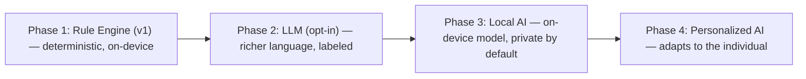

# Phase 7 — AI Rules (Health Assistant)

> Part of the [LifeLedger Specification](00-README-index.md). Depends on: [04](04-database-design.md), [06](06-health-rules.md), [18](18-health-decision-engine.md). Feeds: [08](08-feature-specs.md).
> Science context: [Knowledge Base](../knowledge/00-index.md); safety stance: [decisions/why-ai-is-not-a-doctor.md](../decisions/why-ai-is-not-a-doctor.md).

**The AI is a Health Assistant, not a chatbot and not a doctor.** It analyzes patterns, generates
insights, detects trends, and explains — always with uncertainty, never with diagnosis. This
document specifies the v1 rule-based engine and the roadmap to on-device ML.

---

## 1. Principles (hard constraints)

1. **Analyze, don't diagnose.** Insights describe patterns in the user's *own* data. They never
   name diseases, never prescribe, never alarm. Forbidden output is enforced by the safety filter (§6).
2. **Always show uncertainty.** Every insight carries a confidence level ([FR-28](02-requirements.md)).
3. **Explainable by construction.** Every insight stores the evidence that produced it and can show
   its "why" ([FR-29](02-requirements.md)).
4. **Local-first.** v1 runs entirely on-device, offline, deterministic — no cloud LLM, consistent
   with the privacy promise ([01](01-vision.md)). ([ADR-0007](adr/0001-record-architecture-decisions.md#adr-0007))
5. **Data-honest.** No insight is produced without enough data (minimum sample thresholds, §4).
6. **User-controllable.** Insights can be dismissed and rated; the user is never nagged.

---

## 2. Why Rule-Based First (and not a cloud LLM)

| Option | Verdict | Reason |
|---|---|---|
| **Deterministic rule engine (on-device)** | **v1** | Private, offline, explainable, testable, zero inference cost, no hallucination risk on health data. |
| On-device small ML model | Roadmap | Better NL parsing / correlations once value is proven; behind a stable interface. |
| Cloud LLM | Rejected for core | Breaks offline + privacy promises; hallucination risk on health topics; ongoing cost. Could be an *opt-in* accessory later, clearly labeled, never required. |

"AI-Ready" means the **interfaces** (`InsightEngine`, `FoodTextParser`, `CorrelationAnalyzer`) are
defined now so a smarter implementation drops in later without touching the rest of the app.

---

## 2b. AI Evolution Roadmap (Phase 1 → 4)

The AI grows through four phases behind **stable interfaces** — each phase preserves the hard
constraints in §1 (never diagnose, always show uncertainty, privacy-first).

| Phase | Capability | Privacy posture | Interface stability | Entry criteria |
|---|---|---|---|---|
| **1 — Rule Engine** (v1) | Deterministic rules over logged data (§3); safety filter; template output. | Fully on-device, offline, no cloud. | Defines `InsightEngine`, `FoodTextParser`, `CorrelationAnalyzer`. | Ships in v1 ([ADR-0007](adr/0001-record-architecture-decisions.md#adr-0007)). |
| **2 — LLM** (opt-in) | Natural-language explanations / Q&A over the user's *own* summarized data. | **Opt-in only**, clearly labeled; never required; data-minimizing. Cloud LLM is an accessory, not the core ([decisions/why-ai-is-not-a-doctor.md](../decisions/why-ai-is-not-a-doctor.md)). | Same interfaces; new impl behind a flag. | Rule engine proven; safety guardrails extended to generated text. |
| **3 — Local AI** | On-device model for NL parsing + smarter, private insights. | On-device by default — restores full privacy for smarter AI. | Swap impls behind existing interfaces. | Viable on-device models; acceptable perf ([14](14-performance.md)). |
| **4 — Personalized AI** | Adapts thresholds/insights to the individual's baselines and preferences. | On-device personalization; user owns the model state; exportable/erasable. | Same interfaces + a personalization layer. | Enough per-user data; personalization proven to help, not mislead. |

**Invariant across all phases:** no diagnosis, mandatory uncertainty, on-device-first, user control.
A later phase never weakens an earlier phase's privacy or safety.

---

## 3. Insight Rule Catalog (v1)

Each rule has a stable `rule_id` (stored on `insight.rule_id`, [04 §4.7](04-database-design.md)) and is
specified with the full per-rule template: **Trigger · Input · Logic · Confidence · Output · Warning ·
Example · Failure Cases.** Rules consume [Decision Engine](18-health-decision-engine.md) evaluations.
Thresholds are **named constants** (no magic numbers), documented and unit-tested.

The catalog is **extensible**: a new rule = a new `rule_id` + a pure rule function ([09](09-folder-structure.md)) +
tests. No schema change needed.

### `TREND_PROTEIN_UP` — Trend
- **Trigger:** 7-day protein-adherence rises vs. the prior 7 days by ≥ `TREND_DELTA_PCT`.
- **Input:** daily protein vs. `ProteinGoal` ([06 Rule 4](06-health-rules.md)) for 14 days.
- **Logic:** compare "days met" (or mean adherence) across the two windows; require ≥ `MIN_SAMPLE_TREND` days.
- **Confidence:** medium/high (factual trend).
- **Output:** "You hit your protein goal 5 of 7 days last week — up from 2."
- **Warning:** none (positive, factual).
- **Example:** week A 2/7 → week B 5/7 ⇒ fires.
- **Failure Cases:** sparse logging (< sample) ⇒ silence; goal changed mid-window ⇒ use goal-in-force ([04 §4.2](04-database-design.md)).

### `TREND_WEIGHT` — Trend
- **Trigger:** moving-average weight slope over ≥ `MIN_SAMPLE_TREND` days exceeds `WEIGHT_SLOPE_MIN`.
- **Input:** `weight_entry` series ([06 Rule 3](06-health-rules.md), [knowledge/weight_loss.md](../knowledge/weight_loss.md)).
- **Logic:** moving average (not raw readings) → slope classification improving/stable/declining ([18 Trend Evaluation](18-health-decision-engine.md)).
- **Confidence:** medium (descriptive, not predictive).
- **Output:** "Your weight trend is gently down (~0.3 kg/wk) this month."
- **Warning:** if change exceeds a safe rate, gently suggest reviewing goals / a clinician for rapid unexplained change — never diagnose.
- **Example:** 30-day MA slope −0.3 kg/wk ⇒ fires "down".
- **Failure Cases:** too few weigh-ins ⇒ silence; single outlier ⇒ smoothed out by MA.

### `STREAK_WATER_MISS` — Streak
- **Trigger:** water goal missed ≥ `STREAK_MIN_DAYS` (default 3) consecutive days.
- **Input:** daily water vs. `WaterGoal` ([06 Rule 6](06-health-rules.md)).
- **Logic:** count consecutive miss days up to today.
- **Confidence:** high (factual).
- **Output:** "You've been under your water goal 4 days running."
- **Warning:** supportive nudge only; never shaming ([knowledge/psychology/streak-psychology.md](../knowledge/psychology/streak-psychology.md)).
- **Example:** 4 consecutive < goal ⇒ fires.
- **Failure Cases:** unlogged days are **not** assumed misses (missing ≠ zero) ⇒ streak breaks to `insufficient_data`.

### `STREAK_LOG` — Habit
- **Trigger:** logged every day for ≥ `STREAK_LOG_DAYS` (default 7).
- **Input:** presence of any entry per `local_date`.
- **Logic:** consecutive-day count ([18 Consistency Evaluation](18-health-decision-engine.md)).
- **Confidence:** high.
- **Output:** "7-day logging streak — nice consistency."
- **Warning:** none; a **humane** streak — a missed day doesn't erase progress ([knowledge/psychology/streak-psychology.md](../knowledge/psychology/streak-psychology.md)).
- **Example:** 7 straight days with ≥ 1 entry ⇒ fires.
- **Failure Cases:** must not weaponize on break (no guilt notification).

### `CORR_FOOD_SYMPTOM` — Correlation
- **Trigger:** a curated food flag co-occurs with a symptom above chance over the window (§5).
- **Input:** daily food-flag (0/1) vs. `symptom_entry` severity ([knowledge/symptoms.md](../knowledge/symptoms.md), [knowledge/digestion.md](../knowledge/digestion.md)).
- **Logic:** exposed vs. unexposed day comparison; require `MIN_EXPOSED_DAYS`; effect ≥ threshold (§5).
- **Confidence:** **capped at medium, defaults low** — association only.
- **Output:** "On days you logged 'dairy', you reported bloating more often (low confidence)."
- **Warning:** explicit "association, not cause; many factors matter; not a medical finding."
- **Example:** bloating on 6/8 dairy days vs 1/12 non-dairy ⇒ fires low.
- **Failure Cases:** too few exposed days ⇒ silence; never tests uncurated pairs (avoids data dredging).

### `CORR_SLEEP_MOOD` — Correlation
- **Trigger:** short-sleep days associate with lower mood over the window.
- **Input:** sleep duration bucket vs. `mood_entry` ([knowledge/sleep.md](../knowledge/sleep.md)).
- **Logic:** exposed (< `SHORT_SLEEP_H`, e.g. 6h) vs. rest; same honesty rules as above.
- **Confidence:** low/medium (association).
- **Output:** "Your mood tends to be lower after nights under 6h (low confidence)."
- **Warning:** association-only; personal pattern (Evidence **D** at individual level).
- **Example:** mean mood 2.4 on short-sleep vs 3.6 otherwise, sufficient sample ⇒ fires.
- **Failure Cases:** sparse mood/sleep logs ⇒ silence.

### `GOAL_PROTEIN_GAP` — Threshold
- **Trigger:** weekly protein averages < `PROTEIN_GAP_PCT` of goal.
- **Input:** 7-day protein vs. goal.
- **Logic:** mean adherence below threshold ([18 Protein Evaluation](18-health-decision-engine.md)).
- **Confidence:** medium (factual gap).
- **Output:** "You're averaging 62% of your protein goal this week."
- **Warning:** gentle; may suggest protein-rich foods ([knowledge/protein.md](../knowledge/protein.md)); never prescriptive.
- **Example:** avg 62% ⇒ fires.
- **Failure Cases:** partial-week/sparse logging ⇒ silence or `insufficient_data`.

### `HYDRATION_TIMING` — Pattern
- **Trigger:** most water logged after `LATE_HOUR` (e.g., 18:00) across the window.
- **Input:** intra-day timestamps of `water_entry` ([knowledge/hydration.md](../knowledge/hydration.md)).
- **Logic:** share of daily water logged late; exceeds `LATE_SHARE_PCT` on enough days.
- **Confidence:** low (behavioral pattern).
- **Output:** "Most of your water comes after 6pm — spreading it out may help."
- **Warning:** suggestion only; framed as an experiment.
- **Example:** > 60% of water after 6pm on 5/7 days ⇒ fires.
- **Failure Cases:** too few logged times ⇒ silence.

---

## 4. Data Sufficiency & Confidence Policy

Insights must not mislead from thin data.

| Confidence | Requires |
|---|---|
| **low** | Minimum viable sample met (e.g., ≥ 5 observations); pattern present but weak/short. |
| **medium** | Larger sample (e.g., ≥ 10–14 days) and a clearer effect. |
| **high** | Robust sample and a strong, stable effect (mostly for factual streaks/trends, not causal claims). |

- **Correlation insights are capped at `medium`** and default to `low` — correlation is never
  presented as causation. Copy always hedges ("tends to", "more often", "may").
- If sample thresholds aren't met, **no insight is generated** (silence over noise).
- Thresholds are **named constants** (`MIN_SAMPLE_CORR`, `TREND_DELTA_PCT`, `STREAK_MIN_DAYS`, …),
  documented and unit-tested — no magic numbers, mirroring [06](06-health-rules.md).

---

## 5. Correlation Method (v1, simple & honest)

v1 uses transparent, explainable statistics — not opaque ML:

1. Build daily series for the two variables over the window (e.g., food-flag present 0/1 vs.
   symptom severity, or sleep-hours bucket vs. mood).
2. Compare the target metric on "exposed" vs. "unexposed" days (difference in means / rates), and
   require a **minimum number of exposed days** (`MIN_EXPOSED_DAYS`).
3. Report only when the difference exceeds a documented effect-size threshold **and** the sample
   is sufficient; attach the counts as evidence.
4. Always label as association, `low`/`medium` confidence, with the explicit note that many factors
   affect symptoms and this is not a medical finding.

**Explicitly out of scope for v1:** multivariate models, p-value hunting across many pairs (which
would inflate false positives). The engine tests a **small, curated** set of physiologically
plausible pairs (food↔symptom, sleep↔mood, water↔energy) to avoid data dredging. This restraint is
a correctness and honesty decision, documented as such.

---

## 6. Safety Filter (mandatory output gate)

Before any insight is stored/shown, it passes a safety filter:

- **No diagnosis / disease naming.** A denylist + template-only generation means insights can only
  say what a template allows; free-form disease language is impossible by construction.
- **No prescriptions** ("take X", "you should stop eating Y forever"). Suggestions are gentle,
  reversible, and framed as experiments ("you could try…").
- **Disclaimer attached.** Every insight surface shows "informational, not medical advice"
  ([05](05-uiux-system.md) §5.5).
- **Red-flag routing (future, careful):** if the app ever detects patterns that warrant a clinician
  (e.g., rapid unexplained weight loss), the *only* action is a neutral suggestion to consider
  speaking with a healthcare professional — never a diagnosis. This is a roadmap item designed
  conservatively and gated behind review.

---

## 7. Natural-Language Food Logging ([FR-15](02-requirements.md))

An accelerator, never the only path ([05](05-uiux-system.md) §5.2).

- **Interface:** `FoodTextParser.parse(text) → List<ParsedFoodCandidate>` returning quantity +
  unit + a fuzzy match into `food_item`, each with a confidence.
- **v1 implementation:** a **deterministic parser** — tokenize, extract quantities/units
  (number words + digits), map remaining tokens to `food_item` via fuzzy/prefix search against the
  local food DB. No network, no LLM.
- **UX guardrail:** parsed results are **always shown for confirmation** before saving; low-confidence
  matches prompt the user to pick. The engine never silently logs the wrong food.
- **Roadmap:** swap the deterministic parser for an on-device NLU model behind the same interface.

---

## 8. Voice & Image Logging (roadmap — interfaces only)

Specified now so the architecture accommodates them; **not implemented in v1**.

| Capability | Interface | v1 status |
|---|---|---|
| Voice logging | `VoiceLogger` → speech-to-text → `FoodTextParser` | Interface defined; no implementation. On-device speech preferred for privacy. |
| Image recognition | `FoodImageRecognizer.recognize(image) → List<ParsedFoodCandidate>` | Interface defined; on-device model later; always user-confirmed. |

Both reuse the confirmation UX and the safety principles above.

---

## 9. Engine Placement & Execution

- The insight engine lives in the **domain/application** layers as pure functions over repository
  data ([03](03-architecture.md)) — testable without a device.
- **When it runs:** on a schedule (e.g., once per day) and on-demand (pull-to-refresh on the
  Insights screen). Heavy aggregation runs off the UI isolate ([03](03-architecture.md) §5).
- **Output:** `insight` rows ([04](04-database-design.md) §4.7) with `rule_id`, `confidence`,
  `evidence_json`, and the analyzed window — fully traceable.
- **Idempotency:** re-running for the same window updates rather than duplicates insights
  (keyed by `rule_id` + window).

---

## 10. Testing the AI ([11](11-testing-strategy.md))

- **Golden datasets:** hand-crafted logs with known patterns → assert exactly which insights fire,
  their confidence, and their evidence.
- **Negative tests:** thin/edge data → assert **no** insight (silence) and no false positives.
- **Safety tests:** assert the filter blocks any diagnosis/prescription phrasing and that every
  insight carries a confidence and disclaimer.
- **Determinism tests:** same input → identical output.

---

## 11. AI Risks

| Risk | Mitigation |
|---|---|
| Insight implies causation | Correlation capped at medium; hedged copy; explicit "association only" note. |
| False positives from data dredging | Curated, plausible pairs only; sample + effect-size thresholds. |
| Perceived as medical advice | Template-only generation; safety filter; persistent disclaimer. |
| Noise/nagging | Minimum-sample gating; dismissible; no repeat once dismissed. |
| Future ML breaks privacy | On-device only; any cloud option is opt-in, labeled, and never required. |

---

*Next: [Phase 8 — Feature Specifications](08-feature-specs.md).*
