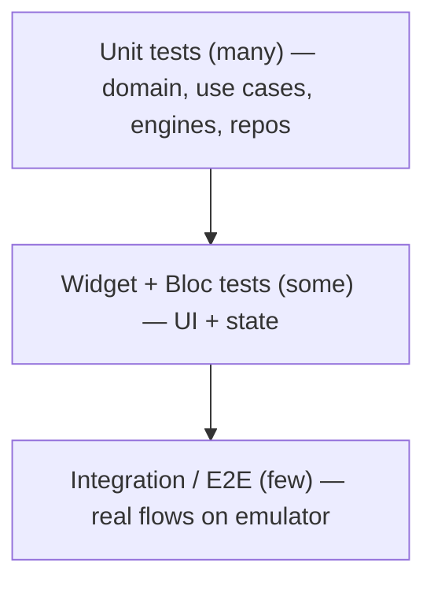

# Phase 11 — Testing Strategy

> Part of the [LifeLedger Specification](00-README-index.md). Depends on: [03](03-architecture.md), [04](04-database-design.md), [10](10-coding-standards.md). Feeds: [12](12-implementation-plan.md).

A health record must be trustworthy. Testing is therefore a first-class requirement, not an
afterthought. This document defines what we test, how, and the coverage gates CI enforces.

---

## 1. Test Pyramid



Most value/coverage comes from **fast unit tests** on the pure domain, health engine
([06](06-health-rules.md)), and AI engine ([07](07-ai-rules.md)) — enabled by Clean Architecture
keeping business logic Flutter-free ([03](03-architecture.md), [NFR-20](02-requirements.md)).

---

## 2. Test Types & Tools

| Level | Scope | Tools |
|---|---|---|
| **Unit** | Entities, value objects, use cases, health engine, AI rules, mappers | `flutter_test`, `mocktail` |
| **Repository/DB** | DAO + repository impls against a **real in-memory SQLite** | `sqflite_common_ffi` |
| **Migration** | v(N-1) → vN preserves data & shape | `sqflite_common_ffi` |
| **Bloc/Cubit** | Event → state transitions | `bloc_test` |
| **Widget** | Screens render each state; interaction | `flutter_test` (`WidgetTester`) |
| **Golden** | Theme/contrast, key components in light+dark | `flutter_test` golden files |
| **Integration/E2E** | Real user flows on an emulator | `integration_test` |

*Rationale for `sqflite_common_ffi`:* it runs real SQLite off-device, so repository and migration
logic are tested for real (constraints, FKs, indexes) in CI without an emulator — fast and honest.

---

## 3. What Each Layer Must Prove

### 3.1 Domain & Health Engine ([06](06-health-rules.md))
- **Every worked example** in [06](06-health-rules.md) becomes a test fixture (BMR, TDEE, calorie,
  protein, macros, water, BMI, health score) — asserting the documented outputs exactly.
- Edge cases from [06](06-health-rules.md) §10: missing weight → `ValidationFailure`; calorie floor
  clamp; water band clamp; `unspecified` sex averaging; division-by-zero renormalization.
- Determinism: identical inputs → identical outputs.

### 3.2 AI Engine ([07](07-ai-rules.md))
- **Golden datasets** with known patterns → assert exactly which `rule_id`s fire, their confidence,
  and their evidence ([07](07-ai-rules.md) §10).
- **Negative tests:** thin/edge data → **no** insight (silence, no false positives).
- **Safety tests:** the safety filter blocks diagnosis/prescription phrasing; every insight has a
  confidence and disclaimer ([07](07-ai-rules.md) §6).
- **Parser tests:** `FoodTextParser` on representative phrases → expected candidates + confidence;
  low-confidence → prompts confirmation (never silent wrong log).

### 3.3 Application (use cases)
- Each use case tested with mocked repositories: happy path + each `Failure` branch.
- Verify orchestration (e.g., logging recomputes day totals; goal edit closes+inserts version).

### 3.4 Infrastructure (repositories/DAOs)
- Against in-memory SQLite: CRUD, soft-delete semantics, FK enforcement, `CHECK` violations →
  mapped `Failure`, correct `local_date` grouping, index-backed queries return expected rows.
- Transactional integrity: a failing multi-row write leaves no partial state ([NFR-13](02-requirements.md)).

### 3.5 Migrations ([04](04-database-design.md) §7)
- For every schema version bump: build a v(N-1) DB with seed data, run `onUpgrade`, assert schema
  shape **and** data preservation. This test is **required** for any schema change ([NFR-11](02-requirements.md)).

### 3.6 Presentation (Bloc + Widget + Golden)
- `bloc_test`: for each Bloc, assert the state sequence for representative events, including error
  states from `Left(Failure)`.
- Widget: each screen renders `Loading/Loaded/Error/Empty`; key interactions dispatch the right events.
- Golden: dashboard + insight card + charts in **light and dark**, verifying contrast/layout
  ([05](05-uiux-system.md) §3) and dataviz readability.
- Accessibility checks: semantic labels present; large-text layout doesn't overflow (where testable).

### 3.7 Integration / E2E (`integration_test`)
Critical flows, each an explicit test:
1. **< 10 s food log** — cold start → quick add → dashboard reflects totals ([FR-10](02-requirements.md)).
2. **Backup → wipe → restore** round-trip preserves all data ([FR-36](02-requirements.md)–39).
3. **Export → import** round-trip is idempotent.
4. **Fully offline run** — all network denied, core flows work ([NFR-9](02-requirements.md)/41).
5. **Onboarding → goals → first insight** with seeded data.

---

## 4. Coverage Targets & Gates

| Area | Line coverage target |
|---|---|
| `core/health` (health engine) | **100%** (pure, formula-critical) |
| `core/ai` (rules + safety filter) | **95%+** |
| Domain + application (use cases) | **90%+** |
| Infrastructure (repos/DAOs/migrations) | **85%+** |
| Presentation (bloc) | **80%+** |
| Overall project | **≥ 85%** |

- CI **fails** below the overall gate and below the health-engine 100% gate.
- Coverage is a floor, not a goal: a well-tested behavior beats a covered line. Reviewers check that
  tests assert *behavior and edge cases*, not just execute code.

---

## 5. Test Data & Determinism

- **Time** is injected via `Clock` ([03](03-architecture.md) §5) — no test depends on the wall clock;
  day-boundary/DST logic is tested with fixed clocks.
- **Builders/fixtures** create entities concisely (`aFoodEntry()`); shared under `test/support/`.
- **Seed datasets** for the AI engine live as versioned fixtures so insight tests are reproducible.
- No test hits the network (there is none to hit); any accidental network use fails the offline test.

---

## 6. CI Pipeline (intent)

On every PR:
```
1. dart format --set-exit-if-changed        # formatting gate ([10] §1)
2. flutter analyze                            # zero-warning gate ([10] §1)
3. flutter test --coverage                    # unit/widget/bloc/golden + coverage
4. coverage gate check (overall + health 100%)
5. (nightly / pre-release) integration_test on emulator matrix
```
Golden updates require explicit review (no silent baseline changes). Migration tests run on every
PR that touches `core/database`.

---

## 7. Definition of "Tested" for a Feature

A feature ([08](08-feature-specs.md)) is "tested" when:
- Its value objects validate (unit), use cases cover happy + failure paths, repository covers
  CRUD + constraints, Bloc covers state transitions, and its primary screen has widget coverage.
- Any health/AI rule it touches has fixtures from [06](06-health-rules.md)/[07](07-ai-rules.md).
- Any schema it introduces has a migration test.
- Its critical user flow (if any) is in `integration_test`.

---

*Next: [Phase 12 — Implementation Plan](12-implementation-plan.md).*
