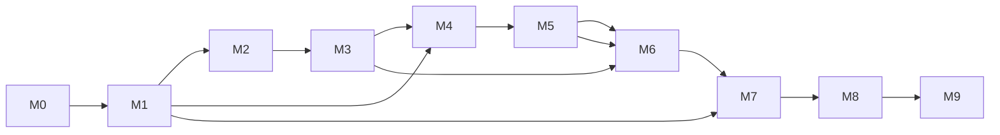

# Phase 12 — Implementation Plan

> Part of the [LifeLedger Specification](00-README-index.md). Depends on: **all** prior phases. This is the bridge from specification to code.

Implementation begins **only after** this specification is reviewed and accepted. This document
sequences the work into dependency-ordered milestones, each with a clear Definition of Done (DoD).

---

## 1. Guiding Sequencing Rule

Build **inside-out** along the Clean Architecture dependency arrows ([03](03-architecture.md)):
`core (errors, DB, DI, health/AI engines) → domain per feature → application → infrastructure →
presentation`. Foundational, high-leverage, pure-and-testable code first; UI polish last.

Each milestone is independently shippable-to-internal and leaves the app in a working, tested state.

---

## 2. Milestones

### M0 — Project Foundation *(enables everything)*
- Create Flutter project, `pubspec.yaml`, Android host (min SDK 24), flavors (dev/prod).
- Wire `analysis_options.yaml` (zero-warning), `dart format`, CI pipeline ([11](11-testing-strategy.md) §6).
- `core/error` (Failure + Result), `core/di` (get_it+injectable), `core/time` (Clock), `AppLogger`.
- `core/database`: `app_database.dart` (FK ON, version constant), migration framework + `v1_initial`.
- `core/theme` (M3 light/dark + tokens), localization scaffold, folder skeleton ([09](09-folder-structure.md)).
- **DoD:** app boots to an empty shell; CI green (format+analyze+test); DB opens at v1; DI self-check passes.

### M1 — Health & AI Engines (pure, no UI) *(highest-value, fully testable)*
- `core/health`: constants ([06](06-health-rules.md) §11), BMR/TDEE, goals, BMI, health score.
- `core/ai`: `InsightEngine` + rule runner, `correlation`, `safety_filter`, `FoodTextParser` v1.
- **DoD:** 100% coverage on health engine, 95%+ on AI; every worked example from [06](06-health-rules.md)
  and every rule from [07](07-ai-rules.md) has passing fixtures ([11](11-testing-strategy.md) §3.1/3.2).

### M2 — Profile, Goals & Onboarding *(F1, F2)*
- Domain/app/infra/presentation slices; goal versioning ([04](04-database-design.md) §4.2).
- Onboarding wizard (skippable) → default goals from the M1 engine.
- **DoD:** create/edit profile; system + user goals persist and version; migration test for any schema; UI covered.

### M3 — Core Logging: Food + Water *(F3, F4)* — the product's heartbeat
- Bundled seed food DB import; `food_item`/`food_entry`/`water_entry`; quick-add (recents/favorites);
  meal timeline; soft-delete + Undo; NL parse (confirm-first).
- **DoD:** **< 10 s food-log** integration test passes ([FR-10](02-requirements.md)); totals correct; offline.

### M4 — Dashboard *(F10)* — the at-a-glance promise
- Indexed aggregate queries; five-question dashboard; Health Score; latest-insight surface; skeletons.
- **DoD:** cold start ≤ 1.5 s on mid-range target ([NFR-1](02-requirements.md)); each metric taps to detail.

### M5 — Remaining Trackers *(F5–F9)*
- Weight (trend/moving average), sleep, mood, symptoms, exercise (no TDEE double-count).
- **DoD:** all log flows + validation + reports data available; correlation inputs ready for M7.

### M6 — Reports *(F12)*
- Day/week/month/year; charts (dataviz palette, both themes); goal-in-force-at-time accuracy;
  pattern overlays.
- **DoD:** 1-year range ≤ 800 ms ([NFR-3](02-requirements.md)); golden tests for charts light+dark.

### M7 — Insights UI *(F11)*
- Insight list + "why?" evidence view; confidence badges; disclaimer; feedback; dashboard surfacing;
  scheduled + on-demand generation.
- **DoD:** safety tests pass; no insight below sample thresholds; explainability shown.

### M8 — Data Ownership *(F14)* + Notifications *(F13)* + Settings *(F15)*
- Encrypted backup/restore (version-headered, migrate-on-restore), JSON/CSV export/import
  (idempotent by UUID), wipe-all; local opt-in reminders; settings (theme/units/privacy;
  disabled "Cloud sync — coming soon").
- **DoD:** backup→wipe→restore and export→import round-trips pass ([11](11-testing-strategy.md) §3.7);
  fully-offline E2E passes with all network denied.

### M9 — Hardening & v1.0 Release
- Accessibility pass (TalkBack, 200% text, contrast), performance profiling vs. all NFR budgets,
  crash-free validation, dependency/privacy audit ([10](10-coding-standards.md) §7), store assets.
- **DoD:** all **M**-priority FRs met; NFRs met or exception-documented; coverage gates green;
  the v1 acceptance criteria in [02](02-requirements.md) §5 satisfied.

---

## 3. Milestone Dependency Graph

M0→M1 unlock the most value early (pure, tested engines). Logging (M3) and dashboard (M4) deliver
the core loop; trackers/reports/insights layer on; data-ownership + hardening close v1.

---

## 4. Cross-Cutting, Every Milestone (Definition of Done)

A milestone is done only when **all** hold:
1. Code respects layer boundaries ([03](03-architecture.md)/[10](10-coding-standards.md)); analyzer zero-warning.
2. Tests written to the targets in [11](11-testing-strategy.md); coverage gates green.
3. Public APIs documented ([10](10-coding-standards.md) §3); no magic numbers.
4. Any schema change ships a tested migration ([04](04-database-design.md) §7).
5. New UI meets accessibility + performance budgets ([05](05-uiux-system.md)/[02](02-requirements.md)).
6. No ads/analytics/network added; dependencies pass the privacy gate.
7. Traceability preserved: touched features still map feature→table→screen→rule→requirement ([08](08-feature-specs.md)).
8. Significant decisions recorded as ADRs.

---

## 5. Post-v1 Roadmap (designed-for; out of v1 scope)

Ordered by likely value; each slots behind an interface/schema hook already present:
1. **Health Connect import** (sleep/exercise/weight) — Persona D; `health_connect_source`.
2. **Optional encrypted cloud sync** — sync columns + UUIDs already in schema ([04](04-database-design.md) §10); opt-in.
3. **On-device NLU / smarter insights** — swap `FoodTextParser`/`InsightEngine` impls.
4. **Voice & image logging** — `VoiceLogger`/`FoodImageRecognizer` ([07](07-ai-rules.md) §8).
5. **Medication tracking** (F: FR-23) — `medication*` tables.
6. **Micronutrients** — `food_item_nutrient`.
7. **Wear OS** glanceable surface — presentation already decoupled from logic.

---

## 6. Risks & Mitigations (execution-level)

| Risk | Mitigation |
|---|---|
| Seed food-DB licensing unresolved | Confirm an openly-licensed dataset in M0/M3 before bundling ([02](02-requirements.md) §4). |
| Performance budgets missed on low-end devices | Profile from M4; SQL aggregation + indexes; measure, don't guess. |
| BLoC boilerplate slows delivery | Cubit for simple state; templates; codegen where safe. |
| Scope creep from "future" features | Interfaces/schema hooks only; features gated by flags; feature-justification rule. |
| Migration mistakes risk data loss | Mandatory migration tests ([11](11-testing-strategy.md) §3.5); forward-only, staged destructive changes. |

---

## 7. Entry Condition for Coding

Coding starts when this spec set is **reviewed, internally consistent, and accepted**:
- Traceability matrix ([08](08-feature-specs.md)) has no orphans.
- All cross-references resolve; constants are single-sourced ([06](06-health-rules.md) §11).
- Open questions (e.g., food-DB license) are tracked with owners.

On acceptance, begin at **M0**.

---

*End of the LifeLedger v1 specification. Return to the [index](00-README-index.md).*
