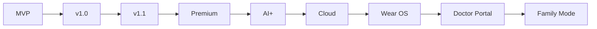

# Phase 15 — Release Roadmap

> Part of the [LifeLedger Specification](00-README-index.md). Depends on: [12](12-implementation-plan.md) (engineering milestones). This is the **product** release ladder — what ships to users, in what order, and why.

The engineering milestones (M0–M9) in [12](12-implementation-plan.md) build v1.0. This roadmap places
v1.0 in the longer product arc and defines each stage's theme, scope, and entry/exit criteria.

---

## 1. The Ladder

Each stage is **additive** and rests on the sync-ready, interface-first foundation already designed in
v1 ([04 §10](04-database-design.md), [07 §8](07-ai-rules.md)). No stage requires a breaking rewrite.

---

## 2. Stages

### MVP — *"Log and see it."*
- **Scope:** profile/goals, food + water logging, dashboard (five questions), basic reports,
  backup/export. Corresponds to engineering M0–M4 + partial M8 ([12](12-implementation-plan.md)).
- **Entry:** spec accepted. **Exit:** the < 10 s food log + at-a-glance dashboard work offline, tested.
- **Purpose:** prove the core loop and the simplicity promise.

### v1.0 — *"Understand your day."*
- **Scope:** all core trackers (weight/sleep/mood/symptoms/exercise), rule-based insights, full reports,
  notifications, settings, encrypted backup/restore, export/import, accessibility + performance passes.
  Engineering M5–M9.
- **Entry:** MVP validated. **Exit:** v1 acceptance criteria ([02 §5](02-requirements.md)) met; store-ready.
- **Purpose:** the complete, private, offline health journal.

### v1.1 — *"Polish and patterns."*
- **Scope:** pattern reports maturity, richer correlations (still rule-based/honest), barcode scan for
  food, quality-of-life UX from real usage feedback, localization expansion (incl. Urdu surfacing).
- **Entry:** v1.0 shipped + feedback gathered. **Exit:** measured retention/logging improvements.

### Premium — *"Support the project, get more."*
- **Scope:** first paid tier (no ads, ever — [why-no-ads.md](../decisions/why-no-ads.md)). Candidates:
  advanced reports/exports, deeper insight history, themes, priority features. Free core stays intact
  ([why-no-subscription-in-mvp.md](../decisions/why-no-subscription-in-mvp.md)).
- **Entry:** demonstrated value + a genuinely-additive premium set. **Exit:** sustainable model without
  degrading the free experience.

### AI+ — *"Smarter, still private."*
- **Scope:** advance the AI along its ladder ([07 AI evolution](07-ai-rules.md)): on-device NLU for food
  parsing, smarter/local insight models — all behind existing interfaces, on-device first. Any cloud AI
  is opt-in and labeled.
- **Entry:** rule engine proven; on-device models viable. **Exit:** better insights with **no** privacy regression.

### Cloud — *"Optional, encrypted sync."*
- **Scope:** opt-in end-to-end-encrypted multi-device sync ([04 §10](04-database-design.md), [13 §10](13-security-privacy.md)).
  Server sees only ciphertext. Fully optional; the app stays 100% functional offline.
- **Entry:** E2E-encryption design validated. **Exit:** sync works without weakening offline-first or privacy.

### Wear OS — *"Glance and log from the wrist."*
- **Scope:** glanceable dashboard + quick logging on the watch; reuse existing Blocs/use cases
  (presentation decoupled from logic, [05 §8](05-uiux-system.md)).
- **Entry:** stable core + sync. **Exit:** watch complications/quick-add shipped.

### Doctor Portal — *"Share with a real clinician."*
- **Scope:** user-controlled, consented sharing of exportable reports with a healthcare professional.
  The clinician decides; the app informs ([why-ai-is-not-a-doctor.md](../decisions/why-ai-is-not-a-doctor.md)).
- **Entry:** robust export + security review. **Exit:** consented, privacy-preserving sharing flow.

### Family Mode — *"Care for the people you love."*
- **Scope:** multiple profiles / caregiver view (e.g., a parent tracking a child, or an adult a parent),
  with strict per-profile privacy and consent. Multi-profile is already schema-ready ([04 §3](04-database-design.md)).
- **Entry:** multi-profile + sharing primitives mature. **Exit:** safe, consent-first family sharing.

---

## 3. Cross-Stage Invariants (never traded away)
Regardless of stage, these hold ([01](01-vision.md), [decisions/](../decisions/00-index.md)):
- Offline-first and fully functional without an account.
- No ads, no data selling, no third-party tracking.
- AI never diagnoses; always states uncertainty.
- User owns and can export/delete all their data.
- New capabilities are **opt-in** and additive — never forced, never privacy-eroding.

---

## 4. Sequencing Rationale
Trust and the core loop first (MVP/v1.0); polish and light monetization once value is proven
(v1.1/Premium); capability depth (AI+/Cloud/Wear) once the private foundation is solid; and the
highest-responsibility features (Doctor Portal, Family Mode) last, when security and consent flows are
mature.

---

*Next: [Phase 16 — Behavioral Design](16-behavioral-design.md).*
