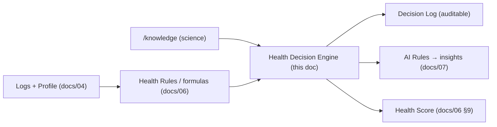

# Phase 18 — Health Decision Engine

> Part of the [LifeLedger Specification](00-README-index.md). Depends on: [06](06-health-rules.md) (formulas), [04](04-database-design.md) (data), [knowledge/](../knowledge/00-index.md) (science). Feeds: [07](07-ai-rules.md) (insights).

The **Health Decision Engine** is the layer *between* raw formulas and user-facing insights. Formulas
([06](06-health-rules.md)) compute **values**; this engine **evaluates** those values into **decisions**
(status + recommendation) with an auditable **Decision Log**; the AI engine ([07](07-ai-rules.md)) then
turns decisions into plain-language insights.



**Why a separate layer?** It removes the overlap between "compute a number" and "decide what it means"
and "phrase it for the user." Each stays pure and testable. The decision engine is **deterministic**
and lives in the domain/application layers ([03](03-architecture.md)).

---

## 1. Anatomy of a Decision
Every evaluator returns a structured **Decision**:
```
Decision {
  domain:        e.g., "protein"
  status:        below | on_track | above | at_limit | insufficient_data
  value:         the computed number (from docs/06)
  target/limit:  the goal/ceiling in force (goal versioning, docs/04 §4.2)
  confidence:    low | medium | high  (mirrors docs/07)
  rationale:     which knowledge/rule produced it (traceability)
  recommendation: gentle, reversible, non-diagnostic (or none)
}
```
- **No diagnosis, ever** ([why-ai-is-not-a-doctor.md](../decisions/why-ai-is-not-a-doctor.md)).
- **`insufficient_data`** is a first-class status — the engine stays silent rather than guessing
  ([07 §4](07-ai-rules.md)).
- Thresholds are **named constants** (like [06 §11](06-health-rules.md)), documented, no magic numbers.

---

## 2. Evaluators

### 2.1 Protein Evaluation
- **Input:** today's protein intake vs. `ProteinGoal` ([06 §5](06-health-rules.md)); recent-days adherence.
- **Logic:** ratio to goal → `below` (< `PROTEIN_LOW_PCT`, default 0.8× goal) / `on_track` / `above`.
- **Recommendation:** if chronically below, suggest protein-rich foods (from [knowledge/protein.md](../knowledge/protein.md)); never prescriptive.
- **Feeds:** `TREND_PROTEIN_UP`, `GOAL_PROTEIN_GAP` ([07](07-ai-rules.md)); score component `W_PROTEIN`.

### 2.2 Weight Evaluation
- **Input:** latest weight + goal/objective ([06 §4](06-health-rules.md)).
- **Logic:** compares current weight and short-window trend to the objective (maintain/lose/gain).
  Uses **trend, not single readings** ([knowledge/weight_loss.md](../knowledge/weight_loss.md)).
- **Recommendation:** reflect progress vs. objective; flag if change is faster than a safe range (suggest
  reviewing goals / considering a clinician for rapid unexplained change — never diagnose).

### 2.3 Water Evaluation
- **Input:** today's water vs. `WaterGoal` ([06 §7](06-health-rules.md)); recent misses.
- **Logic:** `below`/`on_track`; detect consecutive misses and late-day clustering.
- **Feeds:** `STREAK_WATER_MISS`, `HYDRATION_TIMING` ([07](07-ai-rules.md)); score component `W_WATER`.

### 2.4 Sleep Evaluation
- **Input:** sleep duration vs. a healthy range (7–9h, [knowledge/sleep.md](../knowledge/sleep.md)); consistency.
- **Logic:** `below`/`on_track`/`above`; consistency = variance of bedtimes/durations.
- **Recommendation:** gentle consistency nudges; **no** medical interpretation. Feeds `CORR_SLEEP_MOOD`.

### 2.5 BMI Evaluation
- **Input:** BMI ([06 §8](06-health-rules.md)).
- **Logic:** WHO category with a **mandatory caveat** that BMI is a screening ratio, not a diagnosis
  ([knowledge/bmi.md](../knowledge/bmi.md)). Status maps to category, always paired with the caveat.

### 2.6 Trend Evaluation (cross-domain)
- **Input:** any time series (weight, protein adherence, water, mood, sleep).
- **Logic:** compute a **moving average** and slope over a window; classify `improving` / `stable` /
  `declining` with a minimum sample ([07 §4](07-ai-rules.md)). Powers `TREND_WEIGHT`, `TREND_PROTEIN_UP`.
- **Honesty:** trends are descriptive, not predictive; confidence scales with sample size.

### 2.7 Consistency Evaluation (behavioral)
- **Input:** logging completeness over a window.
- **Logic:** did the user log at all / hit goals on N of last M days? Powers `STREAK_LOG` and the
  score's `W_LOGGED` component — the habit that makes everything else work
  ([knowledge/psychology/habit-formation.md](../knowledge/psychology/habit-formation.md)).
- **Humane:** rewards consistency **without punishing** misses ([streak-psychology](../knowledge/psychology/streak-psychology.md)).

---

## 3. Composition → Health Score
The **Health Score** ([06 §9](06-health-rules.md)) is the weighted composition of these evaluations'
adherence — a **goal-adherence** indicator, explicitly **not a medical verdict**
([why-health-score-exists.md](../decisions/why-health-score-exists.md)). The engine computes each
component's clamped adherence and the score renormalizes over available components (missing goals are
dropped, not penalized).

---

## 4. The Decision Log (auditability)
Every decision the engine makes is **recorded** so the app can explain itself and so behavior is
reproducible and reviewable.

- **Purpose:** explainability ("why did I see this?"), debugging, and trust — nothing about the user's
  health status is a black box.
- **Storage:** decisions that surface to the user are captured with the `insight` row's `rule_id` +
  `evidence_json` ([04 §4.7](04-database-design.md)); transient evaluations used only for the dashboard
  need not persist. A dedicated `decision_log` table may be added if durable auditing is required
  (schema-additive, [04](04-database-design.md)).
- **Contents:** timestamp, domain, status, value, target, confidence, rule/knowledge reference.
- **Privacy:** local-only, PII-safe, never networked ([13](13-security-privacy.md)).
- **Idempotency:** re-evaluating the same window updates rather than duplicates (keyed by domain + window),
  matching the insight idempotency rule ([07 §9](07-ai-rules.md)).

---

## 5. Determinism, Safety & Testing
- **Deterministic:** same inputs → same decisions; pure functions ([03](03-architecture.md)).
- **Safety filter applies downstream:** decisions become insights only after the AI safety gate
  ([07 §6](07-ai-rules.md)) — no diagnosis/prescription can escape.
- **Testing:** golden fixtures per evaluator (below/on_track/above/insufficient_data), edge cases
  (no goal set, missing weight), and determinism tests ([11 §3.1/3.2](11-testing-strategy.md)).
- **No magic numbers:** every threshold is a documented named constant with a rationale, cross-linked
  to [knowledge/](../knowledge/00-index.md) and [06 §11](06-health-rules.md).

---

## 6. Placement & Execution
- Lives in the **domain/application** layers ([09](09-folder-structure.md), `core/health` + a decision
  module); consumes repository data; emits Decisions.
- Runs for the **dashboard** (on read) and for **insight generation** (scheduled/on-demand, off the UI
  isolate, [07 §9](07-ai-rules.md), [14 §8](14-performance.md)).

---

*Return to the [specification index](00-README-index.md).*
