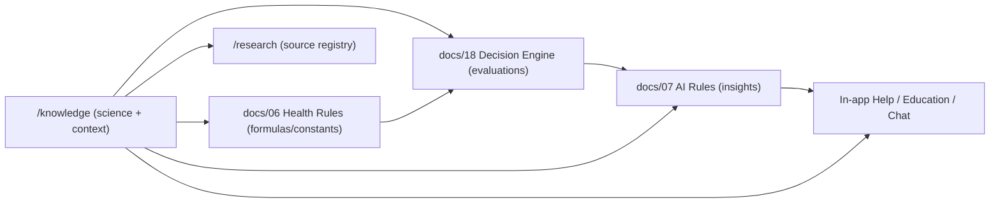

# LifeLedger Knowledge Base — Index

> **Single Source of Truth** for health facts in LifeLedger.
> This knowledge base is *not* just documentation. It is the shared foundation that later powers:
> **AI insights · Health Decision Engine · in-app Help · Education · the future Chat Assistant.**
> One fact has **one home** here; everything else *links* to it rather than restating it.

Return to the [specification index](../docs/00-README-index.md).

---

## 1. Why this exists

Health apps drift into contradiction when the same fact ("how much protein?") is re-typed in the
insight engine, the help screen, and the onboarding copy. LifeLedger avoids that: the *science*
lives here; the *formulas/constants* live in [docs/06 — Health Rules](../docs/06-health-rules.md);
the *evaluation logic* lives in [docs/18 — Health Decision Engine](../docs/18-health-decision-engine.md);
the *user-facing wording* lives in the AI/Help layers. Each layer **references** this base.

---

## 2. The Knowledge File Template

Every topic file **must** contain these sections, in this order:

| Section | Content |
|---|---|
| **Definition** | What it is, plainly. One or two sentences a non-expert understands. |
| **Benefits** | Why it matters for health/behavior. |
| **Deficiency** | What too little looks like (signs, risks) — described, never diagnostic. |
| **Upper Limits** | What too much looks like; safe ceilings where guidance exists. |
| **Sources** | Where LifeLedger's numbers/claims come from → links into [`/research`](../research/00-index.md). |
| **References** | Named public references; `[verify]` where an exact citation must be pinned. |
| **Common Misconceptions** | Myths to actively counter in Help/AI copy. |
| **Evidence Level** | The strength tag(s) for the key claims (scale below). |
| **How LifeLedger Uses This** | Concrete links to the health rule, decision, AI rule, and feature that consume this. |
| **Cross-links** | Related knowledge files + research sources. |

> Files that don't fit perfectly (e.g., symptoms) adapt the wording of a section but keep all of them.

---

## 3. Evidence Level Scale

Every substantive claim is tagged so AI/Help can communicate certainty honestly (this mirrors the
uncertainty mandate in [docs/07 — AI Rules](../docs/07-ai-rules.md)).

| Level | Meaning | Typical basis |
|---|---|---|
| **A** | Strong consensus | Multiple RCTs / systematic reviews / major-body guideline (WHO, IOM/NASEM DRI). |
| **B** | Good evidence | Large observational studies + guideline endorsement. |
| **C** | Emerging / mechanistic | Plausible mechanism, limited or mixed human data. |
| **D** | Anecdotal / individual | Self-reported patterns; useful for *personal* correlation only, never generalized. |

**Rule:** the AI engine may present A/B claims as guidance, must hedge C, and must frame D as
"your personal pattern" only. Correlation insights are **never** presented above their evidence level.

---

## 4. Sourcing Discipline (hard rule)

- Cite only **real, recognized public guidance** (see [`/research`](../research/00-index.md)).
- Where an exact citation, figure, or a localized dataset is **not verifiable**, write the claim and
  tag it **`[verify]`** — never invent a study, number, or DOI.
- Country-specific values (e.g., Pakistan/India food composition) are flagged for sourcing in
  [research/pakistan-nutrition-data.md](../research/pakistan-nutrition-data.md).

---

## 5. Contents

### Nutrition & Body
- [protein.md](protein.md) · [carbohydrates.md](carbohydrates.md) · [fat.md](fat.md) · [fiber.md](fiber.md)
- [water.md](water.md) · [hydration.md](hydration.md)
- [weight_loss.md](weight_loss.md) · [bmi.md](bmi.md)
- [sleep.md](sleep.md) · [exercise.md](exercise.md)
- [digestion.md](digestion.md) · [gut_health.md](gut_health.md) · [symptoms.md](symptoms.md)

### Behavioral Science ("optimize for behavior")
- [psychology/00-index.md](psychology/00-index.md) — habit formation, motivation, streaks, behavior
  change, tiny/atomic habits, decision fatigue, reward systems.

---

## 6. Contribution Rules

1. Keep one fact in one file; link, don't duplicate.
2. Every claim gets an Evidence Level; every number gets a Source (or `[verify]`).
3. If a knowledge change affects a formula, update [docs/06](../docs/06-health-rules.md) and note it.
4. Non-medical framing always: describe patterns and general guidance; never diagnose or prescribe
   (see [decisions/why-ai-is-not-a-doctor.md](../decisions/why-ai-is-not-a-doctor.md)).
